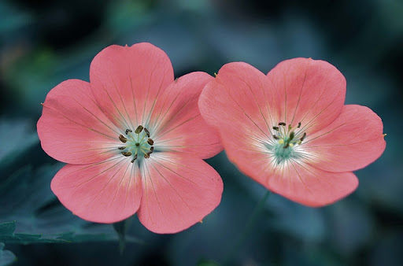
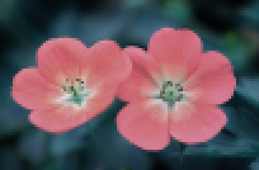

# Image Processor

Welcome to my Image Processing library which provides a set of functions to manipulate images in various ways. It uses the *stb* library to read and write images.

To use the library, simply import the files and read the filename of your choice. You can then use the library's functions before writing back to disk. Supported formats are `png`, `jpg`, `bmp` and `tga`.

```cpp
Image img("flower.jpg");

if (img.is_valid())
{
	// Manipulate image here
	img.write("new-flower.jpg");
}
```

**Base Image:**


### Flipping Images

```cpp
Image& flipX();
```



```cpp
Image& flipY();
```


### Cropping

```cpp
Image& crop(uint16_t start_x, uint16_t start_y, uint16_t new_height, uint16_t new_width);
```


### Resizing

```cpp
Image& resize(int new_width, int new_height);
Image& scale(double ratio);
```


### Grayscaling

```cpp
Image& grayscale_avg();
```


```cpp
Image& grayscale_lum();
```


### Pixelization

```cpp
Image& pixelize(int strength = 2);
```

→ *`strength` represents the width and height of a visible pixel in pixels (i.e. strength of 2 means a 4x4 area of pixels will be regrouped together)*




### Blur

```cpp
Image& gaussian_blur(int strength = 2);
```

→ *`strength` between 1 and 4*


### Edge Detection

```cpp
Image& edge_detection(double cutoff = 115);
```

→ `*cutoff` should be a number between 1 and 255 and represents the value at which pixels > cutoff will be set to 255 and the pixels ≤ cutoff will be set to 0*


### Sharpening

```cpp
Image& sharpen();
```


### Masks

```cpp
Image& color_mask(float r, float g, float b);
```


**Credits:**

- Flower image: [http://absfreepic.com/free-photos/download/small-pink-flowers-4928x3264_99568.html](http://absfreepic.com/free-photos/download/small-pink-flowers-4928x3264_99568.html)
- Stb library: [https://github.com/nothings/stb](https://github.com/nothings/stb)